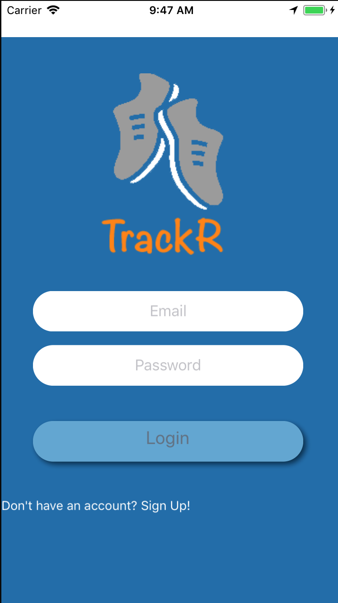
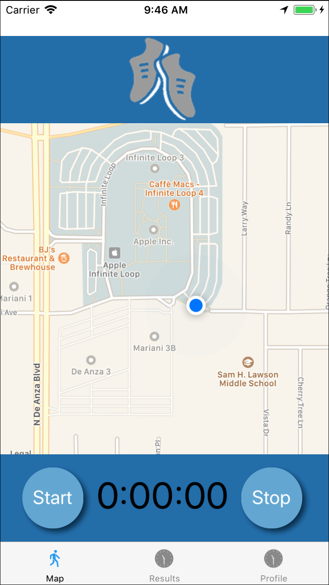

# Trackr

A React Native application that tracks your run and tells you your distance ran,calories burned, and path you took.  This application is supported by an Express server, MySQL database, and Google Maps API.

## Built With

* [React-Native](https://facebook.github.io/react-native/) - The front-end framework used
* [Express](https://expressjs.com/) - The back-end framework used.
* [MySQL](https://www.mysql.com/) - The database used.
* [Google Maps API](https://developers.google.com/maps/) - Used for Geolocation.

## Node Module Dependencies

* axios
* haversine
* minutes-seconds-milliseconds
* react-native-fade-image
* react-native-vector-icons
* react-navigation
* react-redux
* redux
* redux-promise
* tcomb-form-native
* toggle-switch-react-native

## Screenshots

### Login Page

### Map Page

## Authors

* **Casey Zimmerman** - [Github](https://github.com/caseyezimmerman)
* **Chris Malloy** - [Github](https://github.com/chris-malloy)
* **James Downs** - [Github](https://github.com/downs19)

## Acknowledgments

* Thank you to [Robert Bunch](https://github.com/rbunch-dc) who was a big help to this project.
